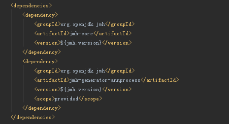

# 第34讲 | 有人说“Lambda能让Java程序慢30倍”，你怎么看？
在上一讲中，我介绍了Java性能问题分析的一些基本思路。但在实际工作中，我们不能仅仅等待性能出现问题再去试图解决，而是需要定量的、可对比的方法，去评估Java应用性能，来判断其是否能够符合业务支撑目标。今天这一讲，我会介绍从Java开发者角度，如何从代码级别判断应用的性能表现，重点理解最广泛使用的基准测试（Benchmark）。

今天我要问你的问题是，有人说“Lambda能让Java程序慢30倍”，你怎么看？

为了让你清楚地了解这个背景，请参考下面的代码片段。在实际运行中，基于Lambda/Stream的版本（lambdaMaxInteger），比传统的for-each版本（forEachLoopMaxInteger）慢很多。

```
// 一个大的ArrayList，内部是随机的整形数据
volatile List<Integer> integers = …

// 基准测试1
public int forEachLoopMaxInteger() {
   int max = Integer.MIN_VALUE;
   for (Integer n : integers) {
  	max = Integer.max(max, n);
   }
   return max;
}

// 基准测试2
public int lambdaMaxInteger() {
   return integers.stream().reduce(Integer.MIN_VALUE, (a, b) -> Integer.max(a, b));
}

```

## 典型回答

我认为，“Lambda能让Java程序慢30倍”这个争论实际反映了几个方面：

第一，基准测试是一个非常有效的通用手段，让我们以直观、量化的方式，判断程序在特定条件下的性能表现。

第二，基准测试必须明确定义自身的范围和目标，否则很有可能产生误导的结果。前面代码片段本身的逻辑就有瑕疵，更多的开销是源于自动装箱、拆箱（auto-boxing/unboxing），而不是源自Lambda和Stream，所以得出的初始结论是没有说服力的。

第三，虽然Lambda/Stream为Java提供了强大的函数式编程能力，但是也需要正视其局限性：

- 一般来说，我们可以认为Lambda/Stream提供了与传统方式接近对等的性能，但是如果对于性能非常敏感，就不能完全忽视它在特定场景的性能差异了，例如： **初始化的开销**。 Lambda并不算是语法糖，而是一种新的工作机制，在首次调用时，JVM需要为其构建 [CallSite](https://docs.oracle.com/javase/8/docs/api/java/lang/invoke/CallSite.html) 实例。这意味着，如果Java应用启动过程引入了很多Lambda语句，会导致启动过程变慢。其实现特点决定了JVM对它的优化可能与传统方式存在差异。

- 增加了程序诊断等方面的复杂性，程序栈要复杂很多，Fluent风格本身也不算是对于调试非常友好的结构，并且在可检查异常的处理方面也存在着局限性等。


## 考点分析

今天的题目是源自于一篇有争议的 [文章](https://blog.takipi.com/benchmark-how-java-8-lambdas-and-streams-can-make-your-code-5-times-slower/)，原文后来更正为“如果Stream使用不当，会让你的代码慢5倍”。针对这个问题我给出的回答，并没有纠结于所谓的“快”与“慢”，而是从工程实践的角度指出了基准测试本身存在的问题，以及Lambda自身的局限性。

从知识点的角度，这个问题考察了我在 [专栏第7讲](http://time.geekbang.org/column/article/7514) 中介绍过的自动装箱/拆箱机制对性能的影响，并且考察了Java 8中引入的Lambda特性的相关知识。除了这些知识点，面试官还可能更加深入探讨如何用基准测试之类的方法，将含糊的观点变成可验证的结论。

对于Java语言的很多特性，经常有很多似是而非的 “秘籍”，我们有必要去伪存真，以定量、定性的方式探究真相，探讨更加易于推广的实践。找到结论的能力，比结论本身更重要，因此在今天这一讲中，我们来探讨一下：

- 基准测试的基础要素，以及如何利用主流框架构建简单的基准测试。

- 进一步分析，针对保证基准测试的有效性，如何避免偏离测试目的，如何保证基准测试的正确性。


## 知识扩展

首先，我们先来整体了解一下基准测试的主要目的和特征，专栏里我就不重复那些 [书面的定义](https://baike.baidu.com/item/%E5%9F%BA%E5%87%86%E6%B5%8B%E8%AF%95) 了。

性能往往是特定情景下的评价，泛泛地说性能“好”或者“快”，往往是具有误导性的。通过引入基准测试，我们可以定义性能对比的明确条件、具体的指标，进而保证得到 **定量的、可重复的** 对比数据，这是工程中的实际需要。

不同的基准测试其具体内容和范围也存在很大的不同。如果是专业的性能工程师，更加熟悉的可能是类似 [SPEC](https://www.spec.org/) 提供的工业标准的系统级测试；而对于大多数Java开发者，更熟悉的则是范围相对较小、关注点更加细节的微基准测试（Micro-Benchmark）。我在文章开头提的问题，就是典型的微基准测试，也是我今天的侧重点。

**什么时候需要开发微基准测试呢？**

我认为，当需要对一个大型软件的某小部分的性能进行评估时，就可以考虑微基准测试。换句话说，微基准测试大多是API级别的验证，或者与其他简单用例场景的对比，例如：

- 你在开发共享类库，为其他模块提供某种服务的API等。

- 你的API对于性能，如延迟、吞吐量有着严格的要求，例如，实现了定制的HTTP客户端API，需要明确它对HTTP服务器进行大量GET请求时的吞吐能力，或者需要对比其他API，保证至少对等甚至更高的性能标准。


所以微基准测试更是偏基础、底层平台开发者的需求，当然，也是那些追求极致性能的前沿工程师的最爱。

**如何构建自己的微基准测试，选择什么样的框架比较好？**

目前应用最为广泛的框架之一就是 [JMH](http://openjdk.java.net/projects/code-tools/jmh/)，OpenJDK自身也大量地使用JMH进行性能对比，如果你是做Java API级别的性能对比，JMH往往是你的首选。

JMH是由Hotspot JVM团队专家开发的，除了支持完整的基准测试过程，包括预热、运行、统计和报告等，还支持Java和其他JVM语言。更重要的是，它针对Hotspot JVM提供了各种特性，以保证基准测试的正确性，整体准确性大大优于其他框架，并且，JMH还提供了用近乎白盒的方式进行Profiling等工作的能力。

使用JMH也非常简单，你可以直接将其依赖加入Maven工程，如下图：



也可以，利用类似下面的命令，直接生成一个Maven项目。

```
$ mvn archetype:generate \
      	-DinteractiveMode=false \
      	-DarchetypeGroupId=org.openjdk.jmh \
          -DarchetypeArtifactId=jmh-java-benchmark-archetype \
      	-DgroupId=org.sample \
      	-DartifactId=test \
      	-Dversion=1.0

```

JMH利用注解（Annotation），定义具体的测试方法，以及基准测试的详细配置。例如，至少要加上“@Benchmark”以标识它是个基准测试方法，而BenchmarkMode则指定了基准测试模式，例如下面例子指定了吞吐量（Throughput）模式，还可以根据需要指定平均时间（AverageTime）等其他模式。

```
@Benchmark
@BenchmarkMode(Mode.Throughput)
public void testMethod() {
   // Put your benchmark code here.
}

```

当我们实现了具体的测试后，就可以利用下面的Maven命令构建。

```
mvn clean install

```

运行基准测试则与运行不同的Java应用没有明显区别。

```
java -jar target/benchmarks.jar

```

更加具体的上手步骤，请参考相关 [指南](http://www.baeldung.com/java-microbenchmark-harness)。JMH处处透着浓浓的工程师味道，并没有纠结于完善的文档，而是提供了非常棒的 [样例代码](http://hg.openjdk.java.net/code-tools/jmh/file/3769055ad883/jmh-samples/src/main/java/org/openjdk/jmh/samples)，所以你需要习惯于直接从代码中学习。

**如何保证微基准测试的正确性，有哪些坑需要规避？**

首先，构建微基准测试，需要从白盒层面理解代码，尤其是具体的性能开销，不管是CPU还是内存分配。这有两个方面的考虑，第一，需要保证我们写出的基准测试符合测试目的，确实验证的是我们要覆盖的功能点，这一讲的问题就是个典型例子；第二，通常对于微基准测试，我们通常希望代码片段确实是有限的，例如，执行时间如果需要很多毫秒（ms），甚至是秒级，那么这个有效性就要存疑了，也不便于诊断问题所在。

更加重要的是，由于微基准测试基本上都是体量较小的API层面测试，最大的威胁来自于过度“聪明”的JVM！Brain Goetz曾经很早就指出了微基准测试中的 [典型问题](https://www.ibm.com/developerworks/java/library/j-jtp02225/)。

由于我们执行的是非常有限的代码片段，必须要保证JVM优化过程不影响原始测试目的，下面几个方面需要重点关注：

- 保证代码经过了足够并且合适的预热。我在 [专栏第1讲](http://time.geekbang.org/column/article/6845) 中提到过，默认情况，在server模式下，JIT会在一段代码执行10000次后，将其编译为本地代码，client模式则是1500次以后。我们需要排除代码执行初期的噪音，保证真正采样到的统计数据符合其稳定运行状态。


  通常建议使用下面的参数来判断预热工作到底是经过了多久。

```
-XX:+PrintCompilation

```

我这里建议考虑另外加上一个参数，否则JVM将默认开启后台编译，也就是在其他线程进行，可能导致输出的信息有些混淆。

```
-Xbatch

```

与此同时，也要保证预热阶段的代码路径和采集阶段的代码路径是一致的，并且可以观察PrintCompilation输出是否在后期运行中仍然有零星的编译语句出现。

- 防止JVM进行无效代码消除（Dead Code Elimination），例如下面的代码片段中，由于我们并没有使用计算结果mul，那么JVM就可能直接判断无效代码，根本就不执行它。

```
public void testMethod() {
   int left = 10;
   int right = 100;
   int mul = left * right;
}

```

如果你发现代码统计数据发生了数量级程度上的提高，需要警惕是否出现了无效代码消除的问题。

解决办法也很直接，尽量保证方法有返回值，而不是void方法，或者使用JMH提供的 [BlackHole](http://hg.openjdk.java.net/code-tools/jmh/file/3769055ad883/jmh-core/src/main/java/org/openjdk/jmh/infra/Blackhole.java) 设施，在方法中添加下面语句。

```
public void testMethod(Blackhole blackhole) {
   // …
   blackhole.consume(mul);
}

```

- 防止发生常量折叠（Constant Folding）。JVM如果发现计算过程是依赖于常量或者事实上的常量，就可能会直接计算其结果，所以基准测试并不能真实反映代码执行的性能。JMH提供了State机制来解决这个问题，将本地变量修改为State对象信息，请参考下面示例。

```
@State(Scope.Thread)
public static class MyState {
   public int left = 10;
   public int right = 100;
}

public void testMethod(MyState state, Blackhole blackhole) {
   int left = state.left;
   int right = state.right;
   int mul = left * right;
   blackhole.consume(mul);
}

```

- 另外JMH还会对State对象进行额外的处理，以尽量消除伪共享（ [False Sharing](https://blogs.oracle.com/dave/java-contended-annotation-to-help-reduce-false-sharing)）的影响，标记@State，JMH会自动进行补齐。

- 如果你希望确定方法内联（Inlining）对性能的影响，可以考虑打开下面的选项。


```
-XX:+PrintInlining

```

从上面的总结，可以看出来微基准测试是一个需要高度了解Java、JVM底层机制的技术，是个非常好的深入理解程序背后效果的工具，但是也反映了我们需要审慎对待微基准测试，不被可能的假象蒙蔽。

我今天介绍的内容是相对常见并易于把握的，对于微基准测试，GC等基层机制同样会影响其统计数据。我在前面提到，微基准测试通常希望执行时间和内存分配速率都控制在有限范围内，而在这个过程中发生GC，很可能导致数据出现偏差，所以Serial GC是个值得考虑的选项。另外，JDK 11引入了 [Epsilon GC](http://openjdk.java.net/jeps/318)，可以考虑使用这种什么也不做的GC方式，从最大可能性去排除相关影响。

今天我从一个争议性的程序开始，探讨了如何从开发者角度而不是性能工程师角度，利用（微）基准测试验证你在性能上的判断，并且介绍了其基础构建方式和需要重点规避的风险点。

## 一课一练

关于今天我们讨论的题目你做到心中有数了吗？我们在项目中需要评估系统的容量，以计划和保证其业务支撑能力，谈谈你的思路是怎么样的？常用手段有哪些？

请你在留言区写写你对这个问题的思考，我会选出经过认真思考的留言，送给你一份学习奖励礼券，欢迎你与我一起讨论。

你的朋友是不是也在准备面试呢？你可以“请朋友读”，把今天的题目分享给好友，或许你能帮到他。